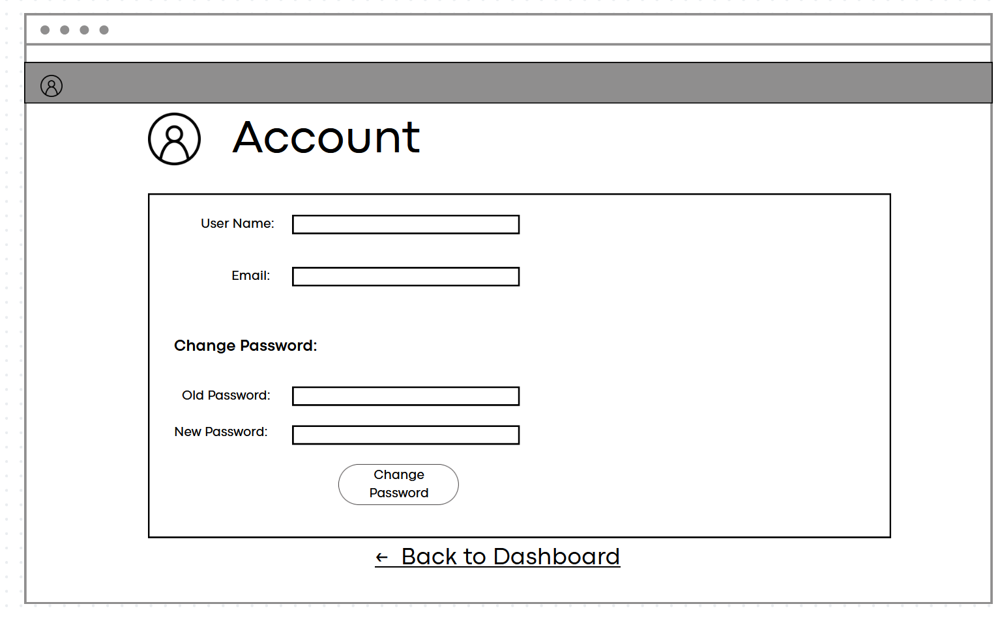

# Expense Planner - Design Document

## Introduction
Our application is a web-based Expenses Planner that allows individuals to track and plan their spending in one place. The target users are those who struggle to keep track of all the bills they have to pay and save money more consistently. The system will allow the users to record their income and expenses, group transactions into different categories (such as rent, food, utilities, and subscriptions), and use a budgeting feature to see how much money they have left over to spend in each category for the month.

## Storyboard
https://share.balsamiq.com/c/1uwoBWLmrwscrsd6NBz7sn.jpg

## User Stories  
- As a user, I want to be able to create an account and log in so that I can securely access my expense data. 
    Given the user wants to create an account
    When they go to create one using the "create account" button
    Then they find an easy account creation service that makes an account from their details like email, name, and password so they can use it again
- As a user, I want to be able to add new transactions (income and expenses) with details such as amount, date, category, and description so that I can keep track of my spending. 
    Given the user has made a new payment/transaction
    When they to go to the "add transaction" tab
    Then they are able add a transaction that includes fill in boxes with amount, date, category, and a description
- As a user, I want to be able to view my transactions in a list format and filter them by date, category, or amount so that I can easily analyze my spending habits. 
    Given the user has made several transactions and entered them
    When the user goes to the "transaction" tab
    Then they are able to filter them with multiple categories like date, category, or by amount ranges, and can hide the filter details once sorting for adaptive and unobtrusive design
- As a user, I want to be able to set a monthly budget for each category so that I can manage my finances better and avoid overspending. 
    Given the user has an idea of a budget they want to set
    When the user goes to the "budget" tab
    Then they are able to easily view previous budgets and add new ones with a few clicks
- As a user, I want to easily see when I am close to reaching my budget limit for a category so that I can adjust my spending accordingly.
    Given the user is close to breaking their limit for their budget
    When the user goes to add a transaction in the "add transaction" tab and enters a category for which there is a budget
    Then the system will have a small popup warning them that they will breach their spending limit or are close if they are within $100 of breaking it.

## Class Diagram 
https://uml.planttext.com/plantuml/png/XLDDJyCm3BttLqGzmT0cTkrfi1MnmyR4DWcEMMfAf7mfSOGcn7ydJJ_MRXDSAllPB-_9TcSEgKKlHP8mGPqZUmUMV2U4Z8aFuRB8o7w_N4H0KGaPsQBbgem0ICh5037XZIzjYsVgFdk5EsAXv0x1tjp6LEYIgrEiFJQ9DmL5s5ZzmGK4xASrjhDKESgGQzNumnCoi4cbzWepiW369HKHgnuDIFZMAJXckQce0_juDA6j9xKBGFJ5B0Jom6IJ52001rRdeLXgUsnyiYRzQvQjG4iT29s1jM0Fx8GVVL42DhA7c0n4fLOOrl8ErAwgC8A2IuuF5pCBZgXWNWIPhG7LxgS3Nwlbg-2-Dd2vfISkiBkbHhbRG3kJh1lMF_EdneXZ_MGj2ChByyuejbpFNrPv2FAtJRxUvbLplEfqcfBncAJtayaexLElbJjRLshrc9EaVvBfgEwOzgZT7VJeqnDz1gge_hnV

## JSON Schema 
{
    "$schema": "http://json-schema.org/draft-06/schema#",
    "$ref": "#/definitions/JSONSchemaMorri2Ei",
    "definitions": {
        "JSONSchemaMorri2Ei": {
            "type": "object",
            "additionalProperties": false,
            "properties": {
                "expenseId": {
                    "type": "integer"
                },
                "amount": {
                    "type": "number"
                },
                "description": {
                    "type": "string"
                },
                "category": {
                    "type": "string"
                },
                "date": {
                    "type": "string",
                    "format": "date"
                },
                "user": {
                    "type": "string"
                }
            },
            "required": [
                "amount",
                "category",
                "date",
                "description",
                "expenseId",
                "user"
            ],
            "title": "JSONSchemaMorri2Ei"
        }
    }
}
## Scrum Roles
Product Owner: Jonas 
Scrum Master: Pranish 
Developers: Ethan 
DevOps: Shrutika

## Github Link
https://github.com/ubnaresd/it4045-group-project.git

## Scrum Board
https://github.com/users/ubnaresd/projects/1

## Teams Link
Weekly Stand-up Meeting
Platform: Microsoft Teams
Time: Sunday 8:00 PM
Link:https://teams.microsoft.com/l/chat/19:5ffa9121024848d3a9baec53f26a2a4f@thread.v2/conversations?context=%7B%22contextType%22%3A%22chat%22%7D
